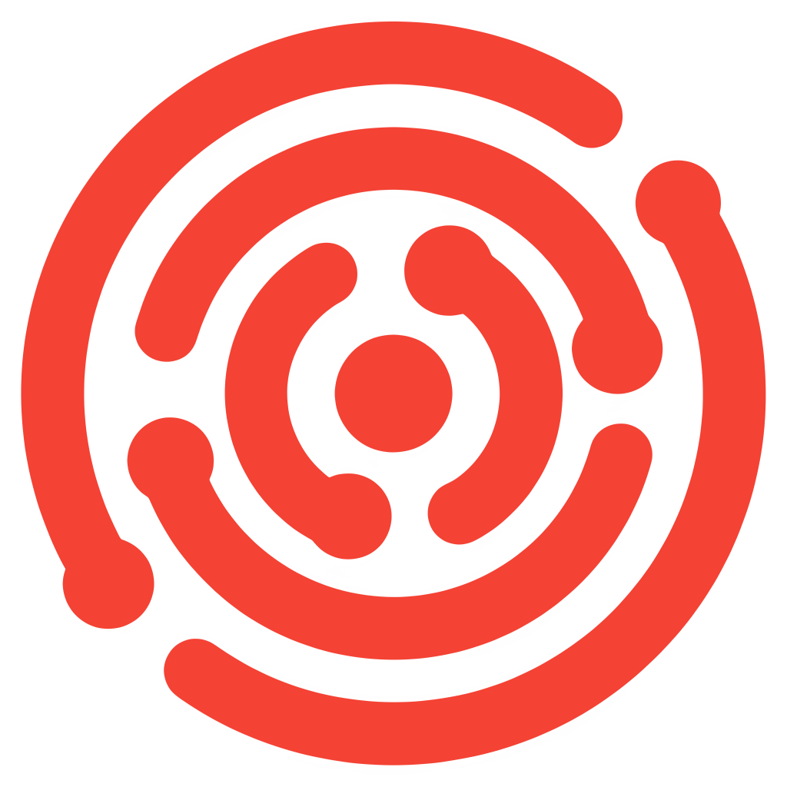

  

  

<h1 align="center">Hi 👋</h1>

A passionate <b>Web Developer</b>, <b>UI Designer</b>, and <b>Open Source Enthusiast</b> 
Building lightweight applications, browser extensions, automation tools, and modern web experiences.

---

# 🌟 Welcome

I'm passionate about creating practical software that improves productivity and simplifies everyday workflows.

I enjoy designing clean user interfaces, developing browser extensions, building Progressive Web Apps, and creating developer-focused tools with performance and simplicity in mind.

My goal is to build projects that are lightweight, easy to use, and open for everyone to learn from and contribute to.

---

# 👋 About Me

- 🌐 Web Developer focused on modern web technologies
- 🎨 UI Designer who enjoys clean and responsive interfaces
- ⚡ Passionate about Browser Extensions & PWAs
- 🤖 Building automation tools for everyday workflows
- 🛠️ Creating developer utilities and reusable components
- ❤️ Active supporter of Open Source software
- 📚 Always learning and experimenting with new technologies

---

# 🚀 Current Focus

- Modern JavaScript Applications
- Browser Extensions
- Progressive Web Apps (PWA)
- Open Source Projects
- Node.js Development
- Developer Tools
- UI Components
- Automation Workflows

---

# 💡 Philosophy

> **Build software that solves real problems, stays lightweight, and remains enjoyable to use.**

---

# 🏢 Organizations & Communities

<table>
<tr>

<td align="center" width="33%">

<a href="https://mainroute-core.github.io/">

### MainRoute Core

**Founder**

Building open-source software, web applications, and developer tools.

</a>

</td>

<td align="center" width="33%">

<a href="https://mainroute-core.github.io/mrd/">

### MindRise Designs

**Founder**

Creative UI/UX designs, branding, graphics, and digital experiences.

</a>

</td>

<td align="center" width="33%">

<a href="https://ggcokara.github.io/">

### GGCOkara

**Open Source Maintainer**

Maintaining projects and contributing to the community.

</a>

</td>

</tr>
</table>

---

# 🤝 Collaboration

I'm always interested in collaborating on projects related to:

- 🌐 Web Development
- 🧩 Browser Extensions
- ⚡ JavaScript Libraries
- 📱 Progressive Web Apps
- 🤖 Automation
- 🎨 UI Components
- ❤️ Open Source

# 🛠️ Tech Stack

<h1 align="center"> 🌐 Frontend ⚙️ Backend 🎨 UI / Design 🛠 Tools</h1>

---

## ⭐ Featured Repositories

| Repository | Description |
|------------|-------------|
| [💰 Budgeted](https://github.com/MegaMind-Solution/Budgeted---Shared-Expense-Tracker-With-Guest-Mode-Features) | A collaborative budget and expense tracker for households, trips, and personal use. Easily split bills, manage shared budgets, and track expenses by category. |
| [🚀 Chrome App Launcher](https://github.com/MegaMind-Solution/Chrome-App-Launcher) | Quickly access Google™ services, websites, and APIs from a clean and lightweight browser extension designed for speed and productivity. |
| [📝 MDEditore](https://github.com/MegaMind-Solution/MDEditore) | A modern, customizable, and lightweight WYSIWYG Markdown editor built with pure JavaScript and no external dependencies. |
| [⭐ Pro-Profiles](https://github.com/MegaMind-Solution/Pro-Profiles) | A curated collection of inspiring GitHub profile READMEs from developers, designers, and tech enthusiasts worldwide. |
| [📨 Simple Universal Contact Form](https://github.com/MegaMind-Solution/Simple-Universal-Contact-Form) | A universal WordPress contact form plugin featuring a centralized backend, automatic admin detection, reusable architecture, and full editor integration. |
| [🔔 Toaster](https://github.com/MegaMind-Solution/toaster) | A lightweight, zero-dependency JavaScript library that transforms native HTML `title` attributes into elegant floating toast-style tooltips. |

---

# 📊 GitHub Analytics

<picture>
<source media="(prefers-color-scheme: dark)" srcset="https://commit-history.com/embed/MegaMind-Solution?theme=dark" />
  
</picture>

---

> **Note:** You'll need to add the GitHub Action that generates the snake animation.

---

# 🌐 Connect With Me

---

# 👀 Profile Views

---

# 💬 Favorite Quote

> **"Great software isn't built by adding more features—it's built by removing unnecessary complexity."**

---

### Thanks for visiting my profile! ❤️

*"Keep learning, keep building, and keep sharing."*

